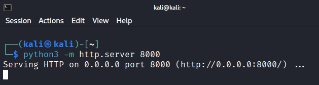
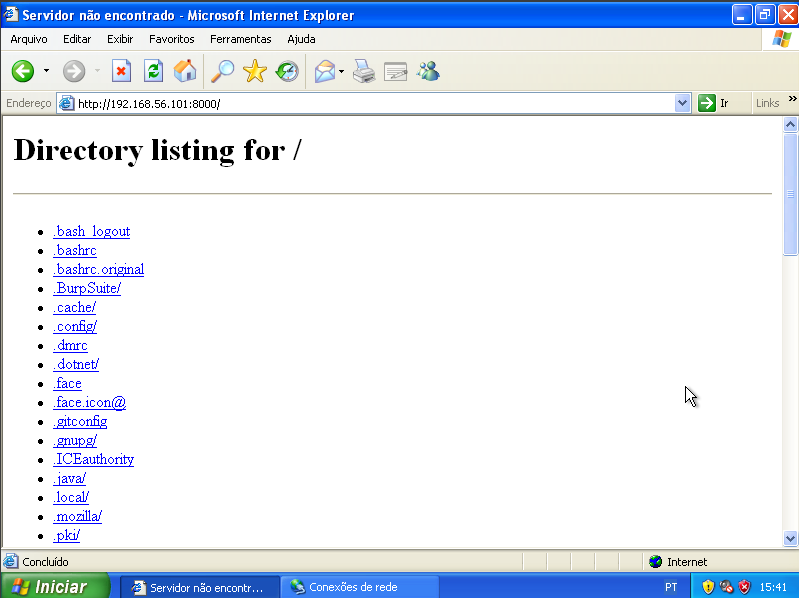
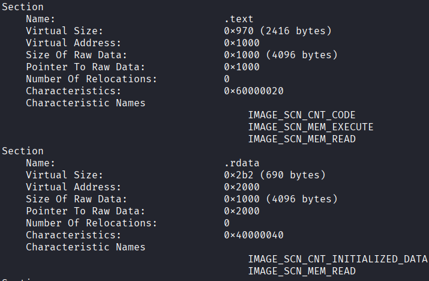
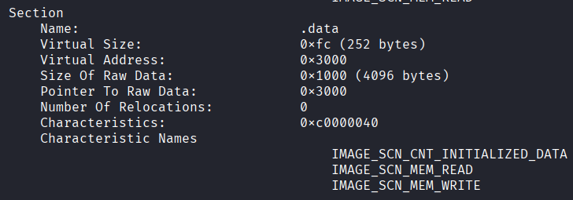
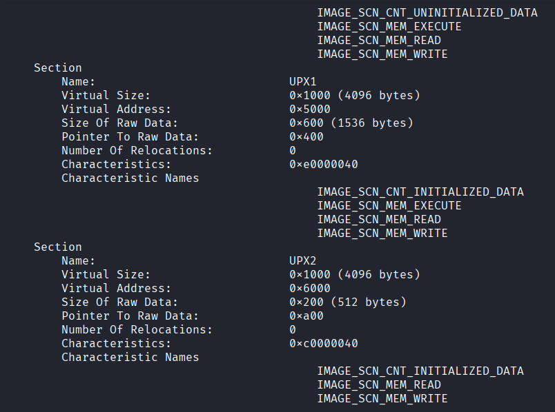

## Adquirindo os arquivos

No ambiente virtual kali linux, eu criei um servidor dedicado para fazer a instalação dos arquivos maliciosos. Para realizar isso dentro da vm, é necessário habilitar o modo NAT e depois voltar para o modo host-only.

Após instalar o zip com os arquivos, verifico o ip da máquina host para realizar a ponte para a transferência dos arquivos:

IP: 10.0.2.15/24
E para subir um servidor simples com python, bastou o comando:
`python3 -m http.server 8000`

Depois, acessei na máquina xp pelo navegador o servidor “192.168.56.101:8000”

Escolho o arquivo e faço a instalação. Realizo o mesmo processo com as ferramentas necessárias.

## Analisando os arquivos Lab01-01.exe e Lab01-01.dll no virus total:

O arquivo é um trojan que tem a classificação: trojan.ulise/aenjares foi compilado no dia 19/12/2010 às 16:16:19 UTC. Essa informação é consistente com malwares da época, porém pode ter sido manipulada e deve ser validada com outras evidências.
### Identificando possíveis ofuscações:

Utilizando o kali linux, instalei a ferramenta readpe, que é parecida com o peview só que para linux. Analisando o arquivo com:
`readpe "Practical Malware Analysis Lab 01-01.exe_"`

Analisando nomes de funções, percebi que não houve ofuscação já que os nomes são comuns, como: CreateFileA, CopyFileA, FindFirstFileA, MapViewOfFile, UnmapViewOfFile, assim como as bibliotecas utilizadas são comuns: KERNEL32.dll e MSVCRT.dll. As seções do head .text, .rdata  e .data têm tamanho pequeno e também são comuns de arquivos executáveis (são strings comuns). Além disso, os arquivos não possuem permissões de escrever e executar, o que seria suspeito:

-----------------------------------------------------------------------------------------------------------------------------------------------------------------------------------
Análise das bibliotecas:

- KERNEL32.dll → é um módulo do kernel do windows. É responsável por entrada e saída, gerenciamento de memória e criação de processos. É inicializada quando o windows é ativado e é essencial para a execução de alguns serviços. Caso falhe ou falte, então, provavelmente, ocorreu corrupção de arquivos do Windows ou conflitos de DLL
- MSVCRT.dll → é a Microsoft Visual C++ Runtime Library, uma biblioteca de tempo de execução para aplicativos escritos em C/C++também responsável por gerenciamento de memória, entrada e saída. É uma biblioteca de suporte para aplicações windows
-----------------------------------------------------------------------------------------------------------------------------------------------------------------------------------
Uma análise das bibliotecas dll mais importantes:

- NTDLL.dll → é uma biblioteca crítica responsável por tratamento de exceções, gerenciamento de memória e acesso a arquivos. Utilizada por todos os processos. Aplica a API responsável pela comunicação entre o kernel e o modo de usuário.
- USER32/GDI32 → interface. Gerenciamento de janelas, teclado, mouse
- MSVCRT.dll → gerencia runtime, suporte. Possui funções do C, como: malloc, printf, exit
- WS2_32→ rede, ou seja, o programa utiliza comunicação TCP/IP.
- WIINET → rede, comum para browsers, C2. HTTP, FTP
- ADVAPI32 → sistema/registro e permissões
- SHELL32.dll → trata do shell, sistema de arquivos (interação com explorer)
-----------------------------------------------------------------------------------------------------------------------------------------------------------------------------------
Analisando strings com “strings “Practical Malware Analysis Lab 01-01.exe_”, retorna:
`!This program cannot be run in DOS mode.
Richm
.text
`.rdata
@.data //são strings comuns
UVWj
ugh 0@
_^][
SUVW
h00@
_^][
SUVW
h|0@
D$Pj //strings lixo
l$\u
S$QWR
FxRVP
D$$3
D$8R
t$<f
T$PR
hL0@
h|0@
hD0@
_^]3
hp @
 SVW
%8 @
%D @
%\ @
%` @ //strings comuns
CloseHandle
UnmapViewOfFile
IsBadReadPtr
MapViewOfFile
CreateFileMappingA
CreateFileA
FindClose
FindNextFileA
FindFirstFileA
CopyFileA
KERNEL32.dll
malloc
exit
MSVCRT.dll
_exit
_XcptFilter
__p___initenv
__getmainargs
_initterm
__setusermatherr
_adjust_fdiv
__p__commode
__p__fmode
__set_app_type
_except_handler3
_controlfp
_stricmp
kerne132.dll
kernel32.dll
.exe //funções identificadas anteriormente que garantem a manipulação de arquivos
C:\*
C:\windows\system32\kerne132.dll //a biblioteca foi escrito errado -> kerne1, então foi utilizada a técnica masquerade
Kernel32.
Lab01-01.dll
C:\Windows\System32\Kernel32.dll 
WARNING_THIS_WILL_DESTROY_YOUR_MACHINE //a própria string de aviso é um sinal`
Ou seja, o malware cria uma biblioteca falsa, insere na pasta System32 e a executa. Essa técnica é chamada de DLL spoofing/masquerading, cujo fluxo é: 

19Vasculha os arquivos (C:\*) → Cria ou copia arquivos (CopyFileA) → Se copia como: kerne132.dll → Encontra a pasta System32 e se coloca nela para substituir uma biblioteca existente.

### Conclusão

O arquivo é malware que, uma vez presente no sistema e executado, vasculha os arquivos do sistema para fazer uma cópia de um arquivo legítimo ou criar outro arquivo, se estabelece na pasta System32 para se passar como uma dll legítima, praticando um ataque chamado DLL spoofing, ou falsificação de DLL. As indicações para a conclusão são as strings suspeitas (C:\*, C:\windows\system32\kerne132.dll, kerne132.dll).

## Analisando os arquivos Lab01-02.exe e Lab01-02.dll:

Analisando com o virus total, a classificação do arquivo é: trojan.ulise/trojanclicker, entrando nas categorias de trojan e downloader das famílias trojanclicker, clicke3, ulise. Foi criado em 19/01/2011 16:10:41 UTC. É um malware conhecido com outros nomes como: Trojan/Win32.StartPage.C26214 ou Trojan[Downloader]:Win/Agent!ACP.UOUU.

O arquivo possui as seguintes bibliotecas: KERNEL32.dll (sistema), ADVAPI32.dll (registro e permissões), MSVCRT.dll (sistema), WININET.dll (conexão com internet - rede), além das seguintes seções: UPX0, UPX1, IPX2, sendo que as duas primeiras possuem a capacidade de escrever e executar. UPX é um compressor para arquivos executáveis. Também utiliza CREATESERVICEA para persistência.

As strings “LoadLibraryA” e “GetProcAddress” atuam para esconder a presença do malware no sistema. “VirtualProtect” e “VirtualAlloc” indicam alteração de permissões e alocação de memória. A função “InternetOpenA” faz parte da biblioteca “WinINet” e indica conexão inicial com a internet já que é utilizada para iniciar a conexão com a internet.
`!This program cannot be run in DOS mode.
Rich
UPX0
UPX1
UPX2
3.04
UPX!
a\`Y
(23h
MalService //persistência via serviço 
sHGL345
http://w
warean
ysisbook.co //url quebrada para evitar detecção
om#Int6net Explo!r 8FEI
SystemTimeToFile
GetMo
*Waitab'r
Process
OpenMu$x
ZSB+
ForS
ObjectU4
[Vrtb
CtrlDisp ch
Xcpt
mArg
5nm@_
t_fd
dlI37n
olfp
dW|6
lB`.rd
XPTPSW
KERNEL32.DLL
ADVAPI32.dll
MSVCRT.dll
WININET.dll
LoadLibraryA
GetProcAddress
VirtualProtect
VirtualAlloc
VirtualFree
ExitProcess
CreateServiceA
exit
InternetOpenA`
### Conclusão

O arquivo analisado foi empacotado a partir do compressor UPX, apresentando ofuscação já que o código real não está visível, além disso, as seções possuem permissão para escrita e execução. Ao analisar strings mais profundamente, também é possível identificar que o programa resolve funções dinamicamente e dificulta análise utilizando “LoadLibraryA” e “GetProcAddress”, manipulação de memória dinamicamente com “VirtualAlloc”, modifica permissões com “VirtualProtect”, persiste no sistema com “CreateServiceA” e realiza conexões com a internet. 

A presença de LoadLibraryA e GetProcAddress indica resolução dinâmica de APIs, técnica que permite ao malware carregar e executar funções em tempo de execução, dificultando a identificação de seu comportamento na análise estática.

## Analisando os arquivos Lab01-03.exe e Lab01-03.dll:

O arquivo é classificado como: trojan.graftor/genome e foi identificado pelo sistema da microsoft como: Trojan:Win32/Tnega!MSR. Características básicas para reconhecimento: MD5 9c5c27494c28ed0b14853b346b113145 SHA-1 290ab6f431f46547db2628c494ce615d6061ceb8 SHA-256 7983a582939924c70e3da2da80fd3352ebc90de7b8c4c427d484ff4f050f0aec.

É um arquivo executável para windows, primeira vez identificado em: 26/03/2011 às 06:54:39 UTC

A única biblioteca importada foi KERNEL32.dll que importa as funções: LoadLibraryA e GetProcAddress que indicam resolução dinâmica de APIs, técnica utilizada para ocultar chamadas de função e dificultar a análise estática.
>APIs de Biblioteca: Fornecem funções reutilizáveis para facilitar tarefas específicas, como a biblioteca requests em Python para requisições HTTP.
>APIs de Sistema Operacional: Permitem que softwares interajam com o sistema operacional, como a WinAPI no Windows.
>As funções podem ser declaradas antes da execução, como em: CreateFileA( ) ou InternetOpenA( ) ou de forma dinâmica, como é feito nesse arquivo, para ocultar outras chamadas de funções e, consequentemente, suas reais intenções.
Conferindo as strings:
`":Ll
3Bt>O
VQ(8
2]<,M
P@M^
 S>VW
AQ=h
I*G9>
e%nN
ole32.vd
Init
FoCr
U!!C
}OLEAUTLA
IMSVCRTT"b //strings corrompidas ou ofuscadas
_getmas
yrcs
|P2r3Us
p|vuy
fmod
xF*l
KERNEL32.dll
LoadLibraryA
GetProcAddress //strings que confirmam as supeitas de ocultação`
### Conclusão

O arquivo analisado possui a classificação trojan.graftor/genome, sendo identificado como um trojan por vários programas antivírus, como:  google, kaspersky, microsoft ou palo alto. O hash MD5: 9c5c27494c28ed0b14853b346b113145 SHA-1: 290ab6f431f46547db2628c494ce615d6061ceb8 e SHA-256: 7983a582939924c70e3da2da80fd3352ebc90de7b8c4c427d484ff4f050f0aec. Foi identificado pela primeira vez em 26/03/2011 às 06:54:39 UTC.

A biblioteca encontrada foi KERNEL32.dll que disponibiliza as funções “LoadLibraryA” e “GetProcAddress” para ocultar chamadas de funções e esconder o comportamento do arquivo - resolução dinâmica de APIs. Além disso, possui strings corrompidas ou ofuscadas, como: ole32.vd, }OLEAUTLA, IMSVCRTT”b.
