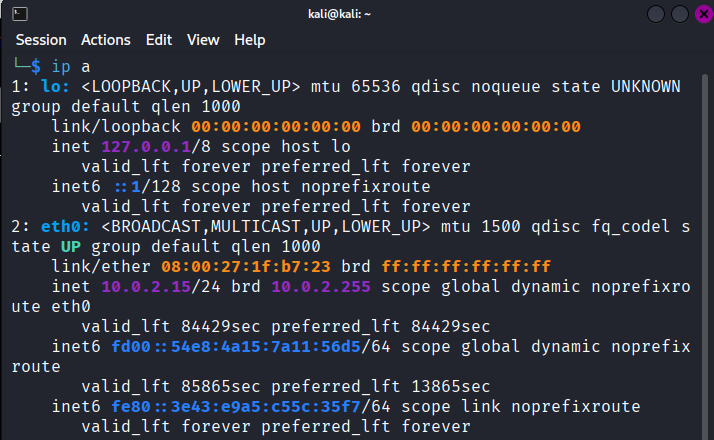

## Adquirindo os arquivos

No ambiente virtual kali linux, eu criei um servidor dedicado para fazer a instalação dos arquivos maliciosos. Para realizar isso dentro da vm, é necessário habilitar o modo NAT e depois voltar para o modo host-only.

Após instalar o zip com os arquivos, verifico o ip da máquina host para realizar a ponte para a transferência dos arquivos:

IP: 10.0.2.15/24
